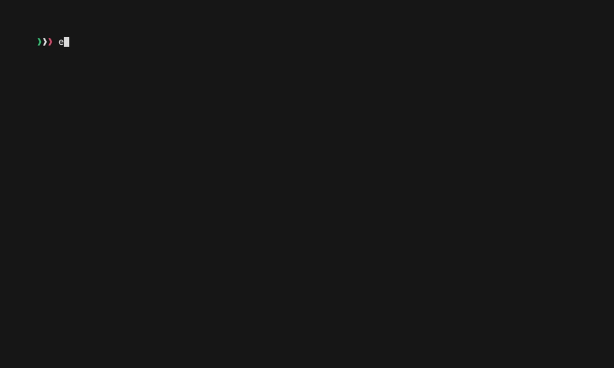

# gg

Yet another set of Greengrass development commands – but one that feels just right.



- Simplifies component management and deployment.
- Supports both local and remote deployment.
- Automatically customizes configurations based on project templates, removing manual edits.
- Uses YAML for both input and output, keeping configurations simple.
- Intuitive CLI powered by [Bashly](https://bashly.dannyb.co/).
- Features autocompletion for faster command execution.

# Dependencies

* [bash](https://www.gnu.org/software/bash/) version 4 or higher
* [awscli](https://docs.aws.amazon.com/cli/latest/userguide/getting-started-install.html) with [required IAM policy](#iam-policy-example)
* [yq](https://mikefarah.gitbook.io/yq#install)

# Installation

Just clone the repo and add it to your `PATH`.

```
git clone <THIS_REPO>
export PATH=<DOWNLOADED_REPO_FOLDER>:$PATH
```

# Usage

```bash
❱ gg -h

gg - Commands for managing Greengrass components and deployments

Usage:
  gg COMMAND
  gg [COMMAND] --help | -h
  gg --version | -v

Commands:
  template            List project templates
  component           Manage components
  remote-deployment   Manage remote deployments
  local-deployment    Manage local deployments

Options:
  --help, -h
    Show this help

  --version, -v
    Show version number

Environment Variables:
  MESSAGE_LEVEL
    Set the command message level
    Allowed: DEBUG, INFO, WARN, ERROR
    Default: DEBUG
```

# Autocompletion

After adding `gg` to your PATH variable, run the following command to enable auto-completion. Adding this to `.bashrc` or `.zshrc` is recommended.

## bash

```
source <DOWNLOAD_REPO_FOLDER>/completions.bash
```


## zsh

If AWS CLI auto-completion is already set up, you can skip this two lines.

```
autoload -Uz compinit && compinit
autoload -Uz bashcompinit && bashcompinit
```
Then
```
source <DOWNLOAD_REPO_FOLDER>/completions.bash
```

# Messge level

Set the message level. The default level is INFO. You can choose from DEBUG, INFO, WARN, or ERROR.

```
export MESSAGE_LEVEL=DEBUG
```

# IAM policy example

Here’s an example IAM policy required for `gg`:

```
{
  "Version": "2012-10-17",
  "Statement": [
    {
      "Effect": "Allow",
      "Action": [
        "s3:CreateBucket",
        "s3:GetBucketLocation",
        "s3:PutObject",
        "s3:ListBucket",
        "greengrass:CreateComponentVersion",
        "greengrass:ListComponentVersions"
      ],
      "Resource": "*"
    }
  ]
}
```

# Example Workflow

Here’s an example workflow to create a new Greengrass component and deploy it:

## Step 1: Initialize a new component

Create a new component template in your project.

```
gg component init my-component
```

```
cd my-component
tree .
.
├── component
│   ├── artifacts
│   ├── recipe.yaml        # You only edit this file
│   ├── recipes
│   └── src                # and files in this directory
│       └── hello-world.py 
├── config.yaml
└── deployment
```

The project is automatically structured for you. The only files you need to edit are the source code within the `src/` directory, the `recipe.yaml` file, and later the `deployment.yaml` file that will be used during deployment. All other folders and files are automatically generated during the build process according to Greengrass specifications, so you don’t need to modify them.

When initializing a component, you can use the `-t` option to specify a template. You can check available component templates with `gg template`. For more details, run `gg component -h` to view the help.

## Step 2: Build, Push and Create the component

Now, let’s build and create the component.

```
# Prepare the component locally
gg component build 1.0.0

# Push to the cloud
gg component push 1.0.0

# Create the component in the cloud
gg component create 1.0.0
```

Alternatively, you can perform these three operations in a single step:

```
gg component pipeline 1.0.0
```

If you see `componentState: DEPLOYABLE`, it means the component is ready for deployment.

## Step 3: Deployment

Let’s deploy the component. There are two deployment methods:
1. Local deployment: Deploy the component built on the Greengrass core device directly to that device.
2. Remote deployment: Deploy the component artifacts stored in the cloud based on the `deployment.yaml` file.


### Step 3-1. Local deployment 

Deploy a component to the local Greengrass core device using the artifacts and recipe created with `gg component build <version>`.

On a Greengrass core device:

```
gg local-deployment deploy 1.0.0
```

Check the deployment status by a deployment id

```
gg local-deployment status ae5c9a0a-4416-4cdb-95f0-627e5d09cae9
```

### Step 3-2: Remote deployment

Initialize by specifying the core node or group that will be the target of the deployment. You can use `-t` option to use a deployment template.

```
gg remote-deployment init gg-core-device-1
```

The `deployment/deployment.yaml` file is created, and you can now edit the file(if you need) and deploy based on its contents.

Let's deploy the component. 

```
gg remote-deployment deploy -w
```

The `-w` option allows you to poll the status after initiating the deployment and display the deployment results. The deployment is complete when `deploymentStatus: COMPLETED` is displayed. Check the status on the core node to verify.


🎉 Now, time to sit back and let Greengrass do its magic! ✨